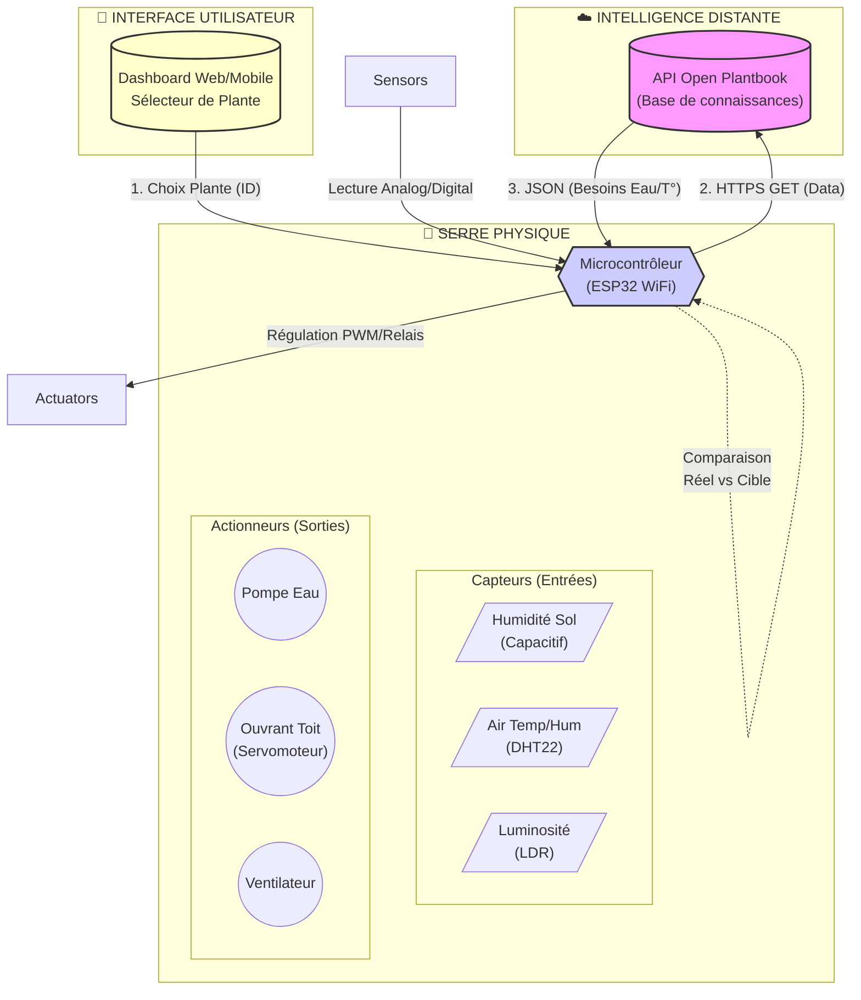
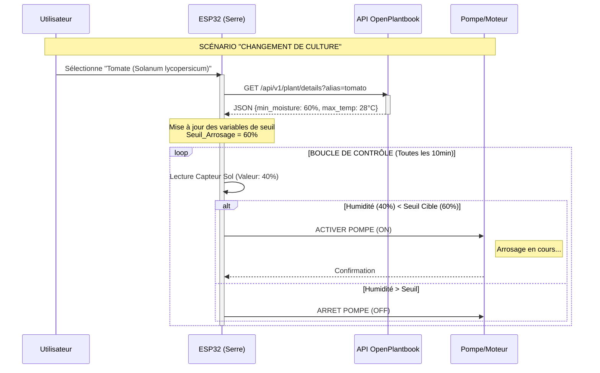
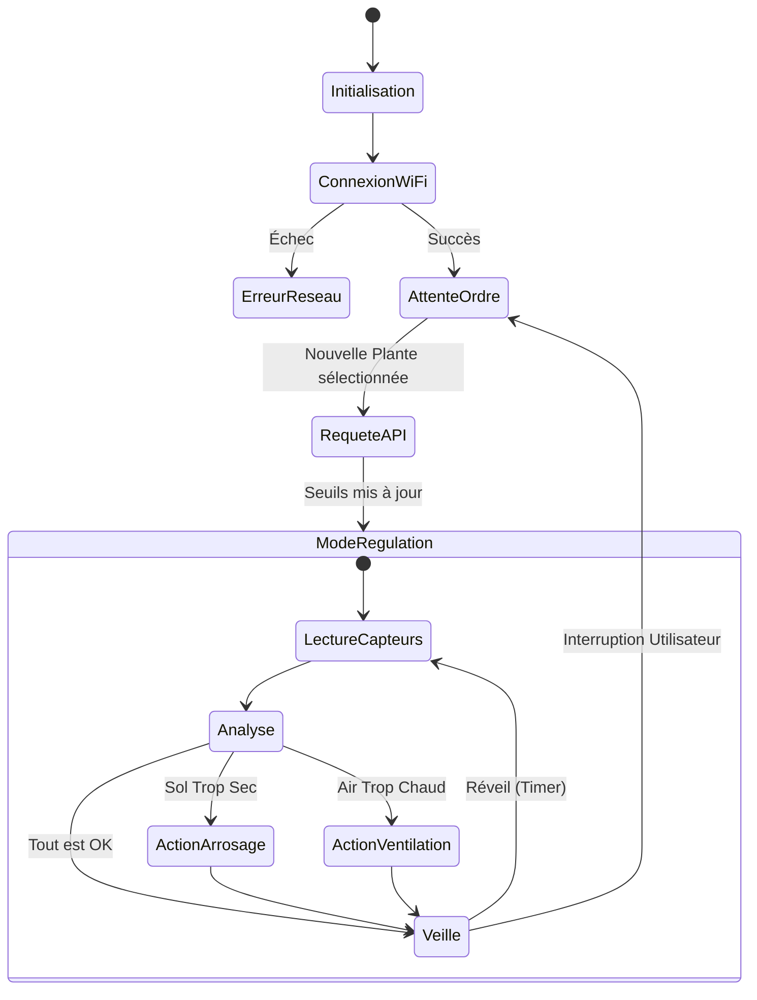

# AVIGNON UNIVERSITÉ | LICENCE PRO SN DOC
**La Salle Avignon – Frères des Écoles Chrétiennes**

---

# 🌿 FICHE PROJET 2026 : SERRE AUTONOME & ADAPTATIVE (AGRITECH)

**Niveau :** Avancé (IoT + Intégration API + Traitement de données)
**Statut :** Lancement Officiel

## 1. Composition de l'Équipe
Ce projet est attribué au groupe de travail suivant :
* **Enzo RIBEIRO** 
* **Michaël CARRU** 
* **Killian HENROT** 
* **Badr ERRAFI** 
---

## 2. Présentation générale du système

### Contexte
L'agriculture de précision (Agritech) ne se contente plus d'automatiser l'arrosage : elle l'optimise biologiquement. Chaque plante possède des besoins spécifiques. Arroser un cactus comme une tomate est une aberration écologique et agronomique.
Le projet vise à concevoir une serre ou un potager d'intérieur intelligent capable de **s'auto-configurer** en fonction de la plante hébergée.

### Objectif & Innovation 2026 : Le "Smart Profiling"
Contrairement aux systèmes classiques basés sur des seuils fixes (ex: *"Si humidité < 30% alors arroser"*), ce système sera **dynamique et connecté**.

1.  **Sélection :** L'utilisateur indique sa culture (ex: "Basilic", "Orchidée") via l'interface.
2.  **Intelligence :** Le système interroge une **API externe** (Open Plantbook) pour récupérer les besoins vitaux en temps réel.
3.  **Adaptation :** Le système paramètre automatiquement les seuils des capteurs (Sol, Air, Lumière) et des actionneurs sans intervention humaine.

---

## 3. Synoptique et Architecture Technique

### A. Architecture Globale
Le système repose sur un ESP32 central qui fait le pont entre le monde physique (la plante) et le monde numérique (l'API).

### B. Diagramme de Séquence : Scénario d'usage
Ce schéma illustre la logique "Adaptative" que l'équipe devra coder pour la soutenance.

### C. Logique de Gestion d'Énergie
Diagramme d'état pour la gestion du mode "Deep Sleep" (optimisation batterie). 

## 4. Ressources & Inspiration (Bibliographie Technique)

L'équipe devra s'appuyer sur les ressources techniques suivantes identifiées lors de l'avant-projet :

* **L'API indispensable :**
    * [Open Plantbook API](https://open.plantbook.io/) : Documentation officielle pour récupérer les données biologiques des plantes (Token requis).
* **Tutoriels & Exemples de réalisation :**
    * **Makery :** "La serre connectée DIY venue du Japon" (Référence pour le design et l'approche open-source).
    * **Instructables :** "Mini Serre Connectée" (Tutoriel technique pas à pas).
    * **Terra Potager :** "Fabriquer une serre à semis autonome" (Focus sur la gestion des semis).

---

## 5. Contraintes et Jalons Spécifiques 2026

Outre le calendrier général de la formation, ce groupe a des objectifs techniques précis :

| Date | Jalon | Livrable Technique Attendu |
| :--- | :--- | :--- |
| **10 Février** | **Jalon 1 (Spécifications)** | **Preuve de concept (POC) API.** L'équipe doit démontrer qu'elle peut récupérer les infos d'une plante via HTTPS et parser le JSON dans la console série de l'ESP32. |
| **14 Avril** | **Jalon 2 (Mi-parcours)** | **Maquette assemblée** avec lecture des capteurs fiable et architecture logicielle validée (Diagrammes Mermaid intégrés au rapport). |
| **19 Juin** | **Soutenance Finale** | **Démonstration adaptative.** Scénario : Changement de comportement immédiat si on passe d'une simulation "Cactus" à "Tomate". |

### Contraintes Matérielles
* **Microcontrôleur :** ESP32 impératif (ou équivalent puissant) pour supporter le chiffrement SSL des requêtes API.
* **Capteurs :** Utilisation de capteurs de sol **capacitifs** (anti-corrosion) obligatoire. Les capteurs résistifs bas de gamme sont interdits.

---

## 6. Critères d'Évaluation Spécifiques

1.  **Qualité du code (Backend) :** Modularité du code C++/MicroPython. Propreté des requêtes API et gestion des erreurs (ex: que se passe-t-il si internet coupe ?).
2.  **Efficacité énergétique :** Capacité du système à se mettre en veille (Deep Sleep) entre deux mesures.
3.  **Finition de la maquette :** Intégration propre des câbles, étanchéité de la partie électronique vis-à-vis de l'eau.
